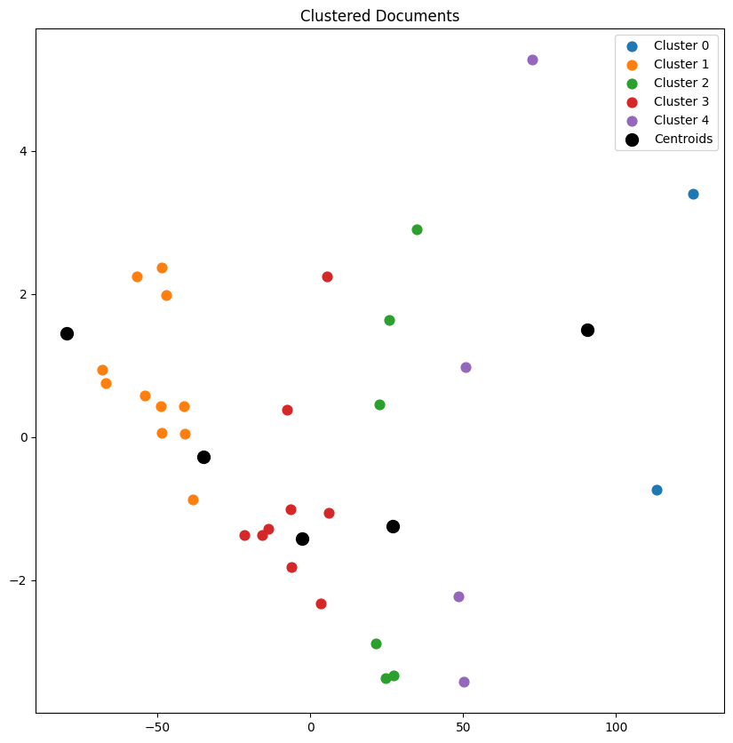

# Topic Modelling of PDF data.

Follow topic_modelling.ipynb file for details.

We are given 32 pdf documents - which are research paper related to LENR (Low energy nuclear reactions). We do preprocessing and do topic modelling through clustering, tfidf and chatgpt api's.

1. Data Cleaning.
    - Convert PDFs to text, and extract the title and abstract  from each document.
    - Programatically preprocess the texts, which involves removing stop words, removing special or unusual characters lowercasing, lemmatization.

2. Embedding Vectors.
    - Word Embeddings (Word2Vec).
    - Document Embeddings (Doc2Vec).

3. Cosine Similarity using Embedding Vectors.

4. Dimensionality reduction through PCA.

5. Clustering through Kmeans.

6. Class-based TF-IDF.

7. Improve topic representations through LLM (chatgpt 3.5 turbo).

Colab Notebook link: [here](https://colab.research.google.com/drive/1-A_AxAxSB6SskD2oIU9kk3PW0yW4y1YM?usp=sharing)

